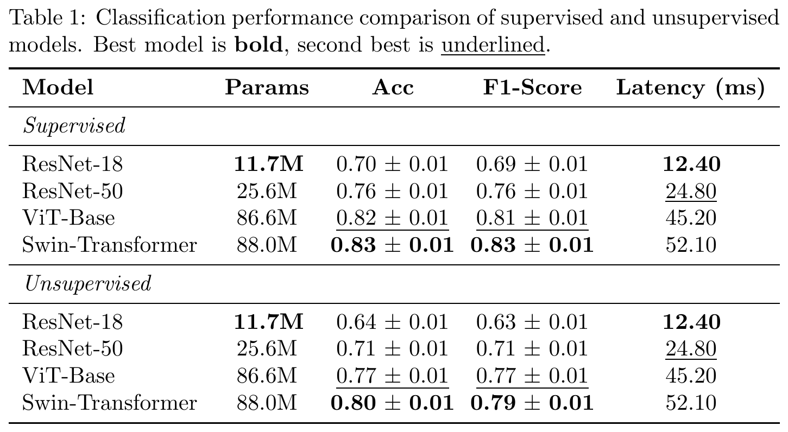

# LaTeX Table Generator (`latex-table-generator`)

A lightweight, flexible Python package to automatically generate publication-ready LaTeX tables from `.csv` metric files, custom `.txt` template files, and reusable `.yaml` rule files.

<p align="center">
  
</p>

---

## Features

- **CSV Metrics Integration**: Load floating-point metrics with row and column headers directly from `.csv` files.
- **Intuitive Placeholders**: Insert metric values into table cells using `{row.column}` syntax.
- **Built-in Uncertainty Support**: Format mean and standard deviation pairs effortlessly using `{row.mean +- row.std}`.
- **Cell Grouping & Rule Files**: Assign cells to groups (e.g. `[accuracy]`, `[latency]`, `[accuracy, best_model]`) and define formatting rules in a reusable `.yaml` file:
  - **Decimals per group**: Set individual decimal precision for each group.
  - **Extremum Highlighting**: Automatically bold and/or underline the highest or lowest numbers in each group (ignoring uncertainties for comparison).
  - **Group Text Colors**: Assign custom colors to groups (`blue`, `red`, `ForestGreen`, `#FF5733`).
  - **Multi-group Cells**: Cells can belong to multiple groups and inherit combined rules.
- **Automatic Column Number Alignment**: Automatically aligns decimal points, minus signs, and uncertainty symbols across rows (via LaTeX `\hphantom{-}` and digit padding), ensuring publication-grade vertical alignment even when columns mix positive and negative numbers.
- **LaTeX Styling & Preservations**: Native support for styling modifiers (`:bold`, `:italic`, `:underline`, `:math`) while preserving all regular LaTeX commands (`\textbf{...}`, `\begin{tabular}`, `\begin{threeparttable}`, `\caption{...}`, `\toprule`, etc.).
- **Automatic Caption Wrapping**: Built-in support for `threeparttable` so long captions cleanly wrap to the exact width of the table.
- **Neat Column Alignment**: Optional `--align` / `align_columns=True` to neatly format and pad table columns in LaTeX source code.
- **Direct PDF & PNG Rendering**: Compile tables directly to PDF and trimmed PNG preview images with `compile_table()` or CLI `--pdf` / `--png`.

---

## Installation

```bash
pip install .
```

Or using `uv`:

```bash
uv pip install .
```

---

## Quickstart

### 1. Metrics File (`examples/metrics.csv`)

<!-- START:examples/metrics.csv -->
```csv
model,acc_mean,acc_std,f1_mean,f1_std,latency,params
s_res18,0.6975,0.0085,0.6920,0.0088,12.4,11689512
s_res50,0.7615,0.0072,0.7580,0.0075,24.8,25557032
s_vit,0.8180,0.0065,0.8145,0.0068,45.2,86567656
s_swin,0.8350,0.0058,0.8310,0.0060,52.1,87985448
us_res18,0.6350,0.0112,0.6285,0.0115,12.4,11689512
us_res50,0.7120,0.0095,0.7075,0.0098,24.8,25557032
us_vit,0.7745,0.0082,0.7710,0.0085,45.2,86567656
us_swin,0.7980,0.0076,0.7940,0.0078,52.1,87985448
```
<!-- END:examples/metrics.csv -->

### 2. Group Rules Configuration (`examples/rules.yaml`)

Define reusable formatting rules for each group:

<!-- START:examples/rules.yaml -->
```yaml
# Group rules configuration for LaTeX table generator
groups:
  # ==========================================================
  # Supervised Models Groups
  # ==========================================================
  params:
    higher_is_better: false
    bold: 1
    si_prefix: true
    decimals: 1

  high_metric:
    higher_is_better: true
    bold: 1
    underline: 2
    decimals: 2

  low_metric:
    copy_from: high_metric
    higher_is_better: false

  s_params: "params"
  s_acc: "high_metric"
  s_top5: "high_metric"
  s_f1: "high_metric"
  s_latency: "low_metric"

  us_params: "params"
  us_acc: "high_metric"
  us_top5: "high_metric"
  us_f1: "high_metric"
  us_latency: "low_metric"

default:
  decimals: 2
```
<!-- END:examples/rules.yaml -->

### 3. Table Template (`examples/template.tex`)

Assign cells to groups using `[group_name]{...}` or `{... | group_name}`:

<!-- START:examples/template.tex -->
```latex
\begin{table}[htbp]
\centering
\begin{threeparttable}
\caption{
Classification performance comparison of supervised and unsupervised models.
Best model is \textbf{bold}, second best is \underline{underlined}.
}
\label{tab:model_comparison}
\begin{tabular}{lcccc}
\toprule
\textbf{Model} & \textbf{Params} & \textbf{Acc} & \textbf{F1-Score} & \textbf{Latency (ms)} \\
\midrule
\multicolumn{5}{l}{\textit{Supervised}} \\
\midrule
ResNet-18        & [s_params]{s_res18.params}   & [s_acc]{s_res18.acc_mean +- s_res18.acc_std}    & [s_f1]{s_res18.f1_mean +- s_res18.f1_std}    & [s_latency]{s_res18.latency} \\
ResNet-50        & [s_params]{s_res50.params}   & [s_acc]{s_res50.acc_mean +- s_res50.acc_std}    & [s_f1]{s_res50.f1_mean +- s_res50.f1_std}    & [s_latency]{s_res50.latency} \\
ViT-Base         & [s_params]{s_vit.params}     & [s_acc]{s_vit.acc_mean +- s_vit.acc_std}        & [s_f1]{s_vit.f1_mean +- s_vit.f1_std}        & [s_latency]{s_vit.latency} \\
Swin-Transformer & [s_params]{s_swin.params}    & [s_acc]{s_swin.acc_mean +- s_swin.acc_std}      & [s_f1]{s_swin.f1_mean +- s_swin.f1_std}      & [s_latency]{s_swin.latency} \\
\midrule
\multicolumn{5}{l}{\textit{Unsupervised}} \\
\midrule
ResNet-18        & [us_params]{us_res18.params} & [us_acc]{us_res18.acc_mean +- us_res18.acc_std} & [us_f1]{us_res18.f1_mean +- us_res18.f1_std} & [us_latency]{us_res18.latency} \\
ResNet-50        & [us_params]{us_res50.params} & [us_acc]{us_res50.acc_mean +- us_res50.acc_std} & [us_f1]{us_res50.f1_mean +- us_res50.f1_std} & [us_latency]{us_res50.latency} \\
ViT-Base         & [us_params]{us_vit.params}   & [us_acc]{us_vit.acc_mean +- us_vit.acc_std}     & [us_f1]{us_vit.f1_mean +- us_vit.f1_std}     & [us_latency]{us_vit.latency} \\
Swin-Transformer & [us_params]{us_swin.params}  & [us_acc]{us_swin.acc_mean +- us_swin.acc_std}   & [us_f1]{us_swin.f1_mean +- us_swin.f1_std}   & [us_latency]{us_swin.latency} \\
\bottomrule
\end{tabular}
\end{threeparttable}
\end{table}
```
<!-- END:examples/template.tex -->

### 4. Generate & Render in Python

```python
from latex_table_generator import compile_table, generate_latex_table

# Generate LaTeX table code
latex_code = generate_latex_table(
    csv_path="examples/metrics.csv",
    template_path="examples/template.tex",
    rules_path="examples/rules.yaml",
    output_path="examples/table_output.tex",
    align_columns=True,
)

# Optional: compile directly to PDF and PNG preview
compile_table(
    table_source="examples/table_output.tex",
    output_pdf="examples/table_output.pdf",
    output_png="examples/table_output.png",
    dpi=300,
)
```

**Generated LaTeX Output (`examples/table_output.tex`):**

<!-- START:examples/table_output.tex -->
```latex
\begin{table}[htbp]
\centering
\begin{threeparttable}
\caption{
Classification performance comparison of supervised and unsupervised models.
Best model is \textbf{bold}, second best is \underline{underlined}.
}
\label{tab:model_comparison}
\begin{tabular}{lcccc}
\toprule
\textbf{Model}   & \textbf{Params}                                                & \textbf{Acc}                                                                                                                     & \textbf{F1-Score}                                                                                                                & \textbf{Latency (ms)} \\
\midrule
\multicolumn{5}{l}{\textit{Supervised}} \\
\midrule
ResNet-18        & \phantom{11}\llap{\textbf{11}}\rlap{\textbf{.7M}}\phantom{.7M} & 0.70 \ensuremath{\pm} 0.01                                                                                                       & 0.69 \ensuremath{\pm} 0.01                                                                                                       & \phantom{12}\llap{\textbf{12}}\rlap{\textbf{.40}}\phantom{.40} \\
ResNet-50        & 25.6M                                                          & 0.76 \ensuremath{\pm} 0.01                                                                                                       & 0.76 \ensuremath{\pm} 0.01                                                                                                       & \underline{24.80} \\
ViT-Base         & 86.6M                                                          & \underline{0.82 \ensuremath{\pm} 0.01}                                                                                           & \underline{0.81 \ensuremath{\pm} 0.01}                                                                                           & 45.20 \\
Swin-Transformer & 88.0M                                                          & \phantom{0.83}\llap{\textbf{0.83}} \rlap{\textbf{\ensuremath{\pm}}}\phantom{\ensuremath{\pm}} \rlap{\textbf{0.01}}\phantom{0.01} & \phantom{0.83}\llap{\textbf{0.83}} \rlap{\textbf{\ensuremath{\pm}}}\phantom{\ensuremath{\pm}} \rlap{\textbf{0.01}}\phantom{0.01} & 52.10 \\
\midrule
\multicolumn{5}{l}{\textit{Unsupervised}} \\
\midrule
ResNet-18        & \phantom{11}\llap{\textbf{11}}\rlap{\textbf{.7M}}\phantom{.7M} & 0.64 \ensuremath{\pm} 0.01                                                                                                       & 0.63 \ensuremath{\pm} 0.01                                                                                                       & \phantom{12}\llap{\textbf{12}}\rlap{\textbf{.40}}\phantom{.40} \\
ResNet-50        & 25.6M                                                          & 0.71 \ensuremath{\pm} 0.01                                                                                                       & 0.71 \ensuremath{\pm} 0.01                                                                                                       & \underline{24.80} \\
ViT-Base         & 86.6M                                                          & \underline{0.77 \ensuremath{\pm} 0.01}                                                                                           & \underline{0.77 \ensuremath{\pm} 0.01}                                                                                           & 45.20 \\
Swin-Transformer & 88.0M                                                          & \phantom{0.80}\llap{\textbf{0.80}} \rlap{\textbf{\ensuremath{\pm}}}\phantom{\ensuremath{\pm}} \rlap{\textbf{0.01}}\phantom{0.01} & \phantom{0.79}\llap{\textbf{0.79}} \rlap{\textbf{\ensuremath{\pm}}}\phantom{\ensuremath{\pm}} \rlap{\textbf{0.01}}\phantom{0.01} & 52.10 \\
\bottomrule
\end{tabular}
\end{threeparttable}
\end{table}
```
<!-- END:examples/table_output.tex -->

### 5. Compiled Visual Preview


---

## WandB Integration

Fetch metrics directly from Weights & Biases (WandB) projects or runs and save them to CSV:

```python
from latex_table_generator import fetch_wandb_metrics

# Option A: Fetch all runs from a WandB project
fetch_wandb_metrics(
    project="denoising_test",
    metrics=["test_loss"],
    output_path="wandb_metrics.csv",
    # Optional: rename columns in CSV
    metric_names=["loss"],
    # Optional: threshold before raising a warning for large number of runs (default 50)
    warn_threshold=50,
    # Optional: show disappearing tqdm progress bar (default True)
    show_progress=True,
    # Optional: enable local disk caching to avoid repeated network requests (default True)
    use_cache=True,
    cache_dir=".wandb_cache",
)

# Option B: Fetch specific run IDs
fetch_wandb_metrics(
    run_ids=["300826143817", "300826145103"],
    metrics=["test_loss"],
    output_path="wandb_metrics.csv",
    # Optional: override model names (defaults to WandB run names)
    run_names=[],
    use_cache=True,
)
```

Generated `wandb_metrics.csv`:
```csv
model,id,loss
snr loss,300826143817,-18.646778106689453
drifting loss,300826145103,0.6875496506690979
```

---

## Grouping & Rules Syntax

### Group Tagging in Templates

| Syntax | Description | Example |
| :--- | :--- | :--- |
| `[group]{placeholder}` | Prefix group assignment | `[acc]{ModelA.acc}` |
| `[g1, g2]{placeholder}` | Multiple groups on a single cell | `[acc, best]{ModelA.acc_mean +- ModelA.acc_std}` |
| `{placeholder \| group}` | Pipe group assignment | `{ModelA.acc \| acc}` |
| `{placeholder \| g1, g2}` | Pipe with multiple groups | `{ModelA.acc \| acc, best}` |
| `[group] PlainText` | Tag plain text cell | `[header_group] Method Name` |

### YAML Rule Options

```yaml
groups:
  group_name:
    higher_is_better: true         # Direction: true for metrics like Accuracy/F1, false for Loss/Latency
    bold: 1                        # Rank(s) to bold: 1 = best, -1 = worst, [1, 2] = top 2, [1, -1] = best & worst
    underline: 2                   # Rank(s) to underline: 2 = 2nd best, -1 = worst
    italic: -2                     # Rank(s) to italicize: -1 = worst, -2 = 2nd worst
    decimals: 2                    # Fixed decimal places (e.g. 0.88)
    si_prefix: true                # Auto-scale with SI prefixes (175000000 -> 175.0M, 0.000025 -> 25.0µs)
    auto_scale: "binary"           # Auto-scale mode: true/"decimal"/"si" (base 1000) or "binary"/"iec" (base 1024)
    scale: 100                     # Multiplier applied before formatting (e.g. 100 to display percentages)
    unit: "%"                      # Unit suffix appended to values (e.g. "%", " ms", " dB", "M")
    # Cell background colors: static color or rank dictionary
    cell_color: "yellow!25"        # Static background for all cells in group
    # OR rank-based cell background colors:
    cell_color_ranks:              # (or under `cell_color:`)
      1: "green!15"                # Rank 1 (best) background color
      2: "yellow!15"               # Rank 2 (second best) background color
      -1: "red!15"                 # Rank -1 (worst) background color
    # OR individual rank keys:
    # cell_color_1: "green!15"
    # cell_color_2: "yellow!15"

    # Text colors: static color or rank dictionary
    color: "blue"                  # Static text color for all cells in group
    # OR rank-based text colors:
    color_ranks:                   # (or under `color:`)
      1: "ForestGreen"             # Rank 1 (best) text color
      -1: "red"                    # Rank -1 (worst) text color
    # OR individual rank keys:
    # color_1: "ForestGreen"

    styles: ["italic"]             # Static styles applied to all cells in group (["bold", "italic", "underline"])
    custom_format: "{:.1f}"        # Optional Python format string
    align_numbers: true            # Align minus signs, decimal points, and +- signs (default: true)
    standard_error_of_mean: 10     # Positive int (sample size N): normalizes std to SEM = std / sqrt(N)

    # Color gradient (heatmap): colors each cell according to its metric value
    color_gradient: true           # Enable gradient mode (must also specify colormap)
    colormap: "Blues"              # Colormap: "Blues", "viridis", "RdYlGn", "coolwarm", etc., or color list
    # vmin: 0.0                    # Optional lower bound (defaults to group min)
    # vmax: 1.0                    # Optional upper bound (defaults to group max)
    # gradient_target: "cell"      # Target to color: "cell" (default) or "text"
    # gradient_text_contrast: true # Automatically use white text on dark cells (default: true)

default:                           # Global fallback options applied to all ungrouped/grouped cells
  decimals: 2
  align_numbers: true
```

#### Rule Options Reference

| Option | Type / Format | Default | Description |
| :--- | :--- | :--- | :--- |
| `higher_is_better` | `bool` | `true` | Determines ranking order. If `true`, highest value is rank 1; if `false`, lowest value is rank 1. |
| `bold` | `int`, `list[int]`, `bool` | `[]` | Rank(s) to bold. `1` = best, `-1` = worst, `[1, 2]` = top 2, `true` = rank 1. |
| `underline` | `int`, `list[int]`, `bool` | `[]` | Rank(s) to underline. `2` = 2nd best, `-1` = worst, etc. |
| `italic` | `int`, `list[int]`, `bool` | `[]` | Rank(s) to italicize. `3` = 3rd best, `-1` = worst, `-2` = 2nd worst, etc. |
| `decimals` | `int` | `None` | Number of decimal places to display (e.g., `2` yields `0.88`). |
| `si_prefix` / `auto_scale` | `bool` or `str` | `None` | Automatically scales large/small numbers with SI prefixes. `true`/`"si"`/`"decimal"` uses base-1000 (`k`, `M`, `G`, `µ`, etc.); `"binary"`/`"iec"` uses base-1024 (`Ki`, `Mi`, `Gi`). |
| `scale` | `float` | `None` | Multiplier applied to values before formatting (e.g., `100` converts `0.85` to `85.0`). |
| `unit` | `str` | `None` | Unit suffix appended after the number and any uncertainty (e.g. `dB`, `ms`, `%`). |
| `standard_error_of_mean` | `int` | `None` | Number of samples $N > 0$ used to compute the standard deviation. Normalizes uncertainty to standard error of the mean ($\text{SEM} = s / \sqrt{N}$). Can be empty/omitted for raw standard deviation. |
| `color_gradient` | `bool` | `false` | Enables color gradient (heatmap) coloring cells according to their metric value. When enabled, `colormap` must also be specified. |
| `colormap` / `cmap` | `str` or `list[str]` | `None` | Colormap to use (e.g., `"Blues"`, `"viridis"`, `"RdYlGn"`, `"coolwarm"`, etc., append `_r` to reverse), or a custom list of colors like `["white", "#08519C"]`. |
| `vmin` / `vmax` | `float` | `None` | Optional lower/upper bounds for gradient normalization. Defaults to the minimum and maximum values in the group. |
| `gradient_target` | `str` | `"cell"` | What gets colored by the gradient: `"cell"` (background via `\cellcolor`) or `"text"` (via `\textcolor`). |
| `gradient_text_contrast` | `bool` | `true` | Automatically adjusts text color to white on dark background cells to maintain high contrast. |
| `cell_color` / `cell_color_ranks` | `str` or `dict[int, str]` | `None` | Cell background color using LaTeX `\cellcolor`. Can be a static color name/hex (e.g. `"yellow!25"`, `"#E8F5E9"`) or a rank dictionary mapping rank integers to colors (e.g. `{1: "green!15", -1: "red!15"}`). |
| `cell_color_<N>` | `str` | `None` | Shortcut to assign background color for rank `N` (e.g. `cell_color_1: "green!15"`, `cell_color_2: "yellow!15"`). |
| `color` / `color_ranks` | `str` or `dict[int, str]` | `None` | Text color. Can be a static color name/hex (e.g. `"blue"`, `"#336699"`) or a rank dictionary mapping rank integers to colors (e.g. `{1: "ForestGreen", -1: "red"}`). |
| `color_<N>` | `str` | `None` | Shortcut to assign text color for rank `N` (e.g. `color_1: "ForestGreen"`). |
| `styles` | `list[str]` or `str` | `[]` | Static styles applied unconditionally to all cells in the group (e.g., `["italic"]`). |
| `custom_format` | `str` | `None` | Custom Python format string (e.g., `"{:.2f}%"`). |
| `align_numbers` | `bool` | `true` | Automatically aligns decimal points, minus signs, and plus-minus (`\pm`) signs in columns without shifting. Set `false` to opt out. |
| `copy_from` / `copy` | `str` | `None` | Group name to copy all settings from (can also override specific options). Alternatively, assign target group directly as a string (e.g. `us_params: "s_params"`). |

#### Rank Indexing & Direction

- **Positive integers (`1, 2, 3, ...`)**: Count from the **best** model (1 = best, 2 = second best, etc.).
- **Negative integers (`-1, -2, -3, ...`)**: Count from the **worst** model (-1 = worst, -2 = second worst, etc.).
- **Ties**: If multiple models share the same rounded value, all tied models receive the assigned style/color.
- **Direction**:
  - When `higher_is_better: true`: Highest value is rank `1`, lowest is rank `-1`.
  - When `higher_is_better: false`: Lowest value is rank `1` (e.g. lowest latency), highest is rank `-1` (worst latency).

#### Multiple Groups & Conflict Resolution

Cells can belong to multiple groups simultaneously using comma-separated tags (e.g., `[accuracy, top_performer]{model.acc}` or `{model.acc | accuracy, top_performer}`).

- **Additive Rules (Styles & Rankings)**:
  - **Rankings**: The cell participates in the ranking of all assigned groups independently. If it earns `bold` in one group and `italic` in another, it receives **both** (`\textbf{\textit{...}}`).
  - **Static Styles (`styles`)**: Static styles from all assigned groups are combined additively without duplicates.
- **Single-Value Rules (Left-to-Right Precedence)**:
  For settings that can only have one value, the **first group** listed in the tag that defines the setting takes precedence:
  - `decimals`, `scale`, `unit`, `auto_scale` / `si_prefix`, `standard_error_of_mean`: First group in the tag with the setting defined wins.
  - `color` / `cell_color`: Dynamic rank colors take precedence over static colors. When choosing among static colors, the first group in the tag with a color defined wins.
  - `align_numbers`: Opt-out precedence — if *any* assigned group specifies `align_numbers: false`, alignment is disabled for that cell.

#### Copying & Inheriting Rules

To avoid repeating configuration across related groups (such as supervised vs. unsupervised versions of the same metric), you can copy rules:

1. **Direct alias / copy (string)**:
   ```yaml
   groups:
     s_params:
       higher_is_better: false
       bold: 1
       si_prefix: true
       decimals: 1

     # us_params gets the exact same rules as s_params, evaluated independently
     us_params: "s_params"
   ```

2. **Copy with overrides (`copy_from`, `copy`, `inherits`, or `extends`)**:
   ```yaml
   groups:
     us_acc:
       copy_from: "s_acc"
       decimals: 3          # Overrides s_acc's decimals
       color: "cyan"        # Overrides s_acc's color
   ```

#### Color Gradients & Colormaps

Enable continuous heatmaps / gradients across table cells based on their numeric values:

```yaml
groups:
  accuracy:
    color_gradient: true
    colormap: "Blues"              # Required when color_gradient is true
    # vmin: 0.0                    # Optional: custom lower bound (default: column minimum)
    # vmax: 1.0                    # Optional: custom upper bound (default: column maximum)
```

- **Colormap requirement**: When `color_gradient: true` is enabled, a `colormap` **must** be specified (e.g., `colormap: "Blues"`). Specifying a `colormap` also enables `color_gradient` automatically.
- **Built-in Colormaps**:
  - **Sequential**: `Blues`, `Greens`, `Reds`, `Purples`, `Oranges`, `Greys`, `YlGn`, `YlOrRd`, `BuGn`, `PuBu`
  - **Perceptually Uniform**: `viridis`, `plasma`, `inferno`, `magma`, `cividis`
  - **Diverging**: `coolwarm`, `RdYlGn`, `RdYlBu`, `bwr`, `seismic`, `Spectral`, `PiYG`, `PRGn`
  - **Reversed**: Append `_r` to any colormap name (e.g. `Blues_r`, `viridis_r`, `RdYlGn_r`).
  - **Custom Color Gradients**: Provide a list of colors (e.g. `colormap: ["white", "#1f77b4"]` or `colormap: ["#d73027", "#ffffbf", "#1a9850"]`).
- **Automatic Text Contrast**: Cells with dark background colors automatically switch their text color to `white` to preserve high readability and contrast (can be disabled with `gradient_text_contrast: false`).
- **Target**: Set `gradient_target: "cell"` (default cell background via `\cellcolor`) or `gradient_target: "text"` (text color via `\textcolor`).

---

## Command-Line Interface (CLI)

```bash
# Generate LaTeX with rules
latex-table-generator metrics.csv template.tex -r rules.yaml -o table.tex --align

# Generate and compile directly to PDF and PNG preview
latex-table-generator metrics.csv template.tex -r rules.yaml --pdf table.pdf --png table.png
```

### CLI Arguments

| Argument | Flag | Default | Description |
| :--- | :--- | :--- | :--- |
| `csv_path` | Positional | *(required)* | Path to `.csv` file containing metrics. |
| `template_path` | Positional | *(required)* | Path to template `.tex` or `.txt` file containing table layout. |
| `--rules` | `-r` | `None` | Path to YAML/JSON rules configuration file defining group rules. |
| `--decimals` | `-d` | `None` | Default number of decimal places for numeric metrics. |
| `--output` | `-o` | `None` | Path to output `.tex` file (prints to stdout if omitted). |
| `--pdf` | | `None` | Path to compile directly to a standalone `.pdf`. |
| `--png` | | `None` | Path to render directly to a `.png` image preview. |
| `--align` | | `False` | Neatly aligns `&` column separators in the output LaTeX table. |
| `--no-align-numbers` | | `False` | Disables automatic decimal/plus-minus digit alignment. |
| `--pm-symbol` | | `\ensuremath{\pm}` | LaTeX symbol to use for uncertainties. |
| `--delimiter` | | `,` | CSV delimiter. |
| `--index-col` | | `0` | Column position or column header name used for model index. |

---

## Synchronizing README Examples

Code snippets in `README.md` can be automatically synchronized with source files in `examples/` using comment markers (`<!-- START:examples/<file> -->` ... `<!-- END:examples/<file> -->`):

```bash
# Synchronize README with examples/
uv run python scripts/update_readme_examples.py

# Check if README is up to date (used in CI/pre-commit)
uv run python scripts/update_readme_examples.py --check
```

---

## Development & Testing

### Running Tests
```bash
uv run pytest
```

### Pre-commit & Code Quality
This project uses **pre-commit** with **ruff** formatting, linting, and automated test execution before every commit:

```bash
# Install git hooks
uv run pre-commit install

# Run all hooks manually
uv run pre-commit run --all-files
```
